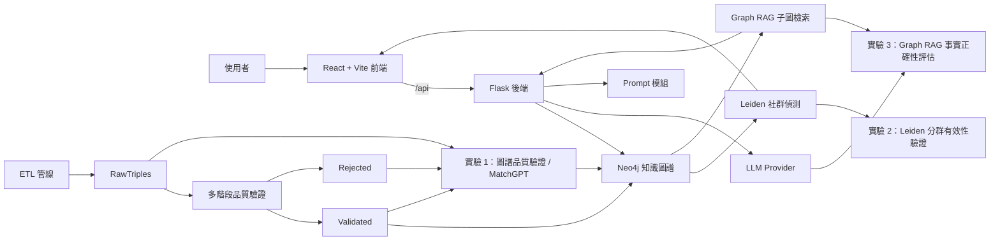
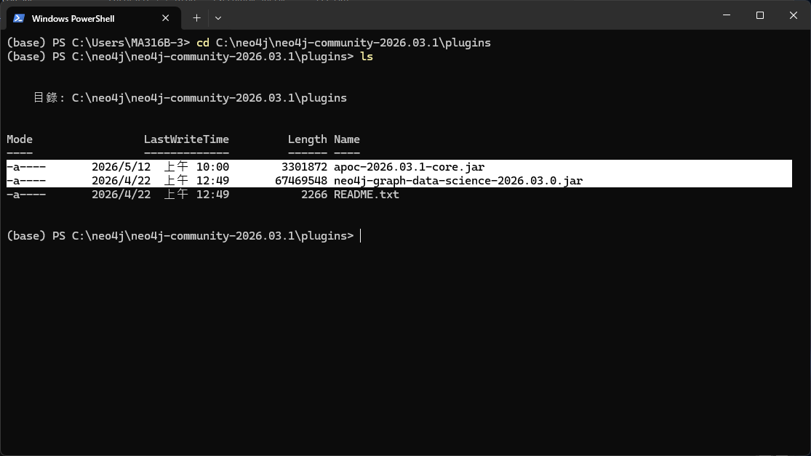

# Cybersecurity Learning Platform

知識圖譜與大型語言模型驅動的資安職能學習平台。

本專案是一個研究型開源原型，目標是探索如何以知識圖譜（Knowledge Graph）、本體論約束（Ontology Constraint）、Graph RAG（Graph-based Retrieval-Augmented Generation）與圖論社群分析，支援資安教育中的知識組織、學習路徑導引與智慧問答。

專案原型來自碩士論文：

> 結合大型語言模型與本體論約束之資安教育知識圖譜建構與品質驗證研究

此 repository 收錄平台前後端原始碼、可公開的結構化資料、實驗腳本與復現材料；不收錄可能包含受著作權保護教材原文的切塊資料。

## 專案特色

- **知識圖譜建構**：由 LLM 萃取資安實體與關係三元組，經品質驗證後匯入 Neo4j。
- **本體論約束驗證**：以實體類型、關係類型與合法邊規格約束三元組品質。
- **Graph RAG 智慧導師**：以 Neo4j 子圖作為回答脈絡，降低純 LLM 回答時的幻覺風險。
- **Leiden 社群偵測**：將資安知識節點分群為主題模組，用於主題瀏覽與學習路徑規劃。
- **章節與學習路徑視覺化**：提供章節導覽、主題模組、技能樹、全知識圖譜與智慧導師介面。
- **實驗復現材料**：收錄圖譜品質驗證、Graph RAG 事實正確性評估、Leiden 分群有效性分析所需腳本與輸出。

## 系統架構



## Repository 結構

| 路徑 | 說明 |
|---|---|
| `CybersecurityLearningPlatform/frontend/` | React 18 + Vite 前端 |
| `CybersecurityLearningPlatform/backend/` | Flask API、Neo4j service、LLM service 與平台核心邏輯 |
| `CybersecurityLearningPlatform/backend/prompts/` | 平台、ETL、MatchGPT 與實驗使用的 Prompt 檔案 |
| `CybersecurityLearningPlatform/backend/ETL_module/RawTriples/` | LLM 萃取出的候選三元組 |
| `CybersecurityLearningPlatform/backend/ETL_module/Rejected/` | 品質驗證流程拒絕的三元組與驗證紀錄 |
| `CybersecurityLearningPlatform/backend/ETL_module/Validated/` | 已通過驗證、可用於重建 Neo4j 圖譜的三元組 |
| `CybersecurityLearningPlatform/backend/exp_1/` | 實驗 1：圖譜品質驗證 |
| `CybersecurityLearningPlatform/backend/exp_1/MatchGPT/` | 實驗 1 的 MatchGPT 節點整併腳本與分析輸出 |
| `CybersecurityLearningPlatform/backend/exp_2/` | 實驗 2：Leiden 分群有效性驗證 |
| `CybersecurityLearningPlatform/backend/exp_2/phase2/` | 實驗 2 的 Leiden/章節結構化執行鏈 |
| `CybersecurityLearningPlatform/backend/exp_3/` | 實驗 3：Graph RAG 事實正確性評估 |
| `本體論/` | 本體論檔案，包含實體、關係與合法 Schema Edge |
| `Prompt/` | 論文方法與附錄使用的 Prompt 彙整說明 |
| `DATA_MANIFEST.md` | 公開資料收錄與排除清單 |
| `REPRODUCE_EXPERIMENTS.md` | 實驗與圖譜復現流程 |
| `SECURITY_NOTES.md` | 憑證、敏感資料與發布注意事項 |

## 快速開始

### 1. 準備 Neo4j



> **必要外掛提醒**
>
> 本專案的知識圖譜還原、Graph RAG 與 Leiden 社群偵測流程會依賴 Neo4j 外掛。
> 啟動 Neo4j 前，請確認 Neo4j 的 `plugins/` 資料夾已包含下列模組：
>
> - `apoc-2026.03.1-core.jar`
> - `neo4j-graph-data-science-2026.03.0.jar`
>
> 若缺少上述外掛，部分 Cypher 查詢、圖演算法與社群偵測相關功能可能無法正常執行。

請先啟動 Neo4j，並確認 Bolt 連線可用。預設連線資訊如下：

```text
NEO4J_URI=bolt://localhost:7687
NEO4J_USER=neo4j
```

若你的 Neo4j 不在本機，請在後端 `.env` 中修改 `NEO4J_URI`、`NEO4J_USER` 與 `NEO4J_PASSWORD`。

### 2. 啟動後端

```powershell
Set-Location -LiteralPath '.\CybersecurityLearningPlatform\backend'
Copy-Item .env.example .env
python -m pip install -r requirements.txt
python app.py
```

預設後端位址：

```text
http://localhost:5000
```

健康檢查：

```powershell
Invoke-WebRequest http://localhost:5000/api/health
```

### 3. 啟動前端

```powershell
Set-Location -LiteralPath '.\CybersecurityLearningPlatform\frontend'
npm install
npm run dev -- --port 3000
```

預設前端位址：

```text
http://localhost:3000
```

Vite 開發伺服器會將 `/api` 代理至 `http://localhost:5000`。如果後端使用其他 port，可指定：

```powershell
$env:VITE_API_PROXY_TARGET='http://localhost:5003'
npm run dev -- --port 3000
```

## 還原示例圖譜

本 repository 不從原始 PDF 切塊開始復現，原因是原始教材內容可能涉及著作權。公開復現路徑從已驗證三元組 `Validated/` 開始。

```powershell
Set-Location -LiteralPath '.\CybersecurityLearningPlatform\backend\ETL_module'
python 03b_restore_neo4j.py
```

還原腳本會連線至 `.env` 指定的 Neo4j。執行前請確認目標資料庫可以被寫入，並先閱讀腳本提示。

以本專案目前資料重建後，平台首頁統計會由後端 API 動態計算；近期驗證資料約為 2,862 個知識節點、4,506 條知識關聯、73 個學習社群與 25 個章節/模組統計單位。若你匯入不同資料，數值會隨圖譜內容改變。

## LLM Provider 設定

後端透過 `.env` 選擇 LLM provider：

```text
LLM_PROVIDER=lm_studio
```

目前支援的設定方向：

| Provider | 用途 |
|---|---|
| `lm_studio` | 本機 OpenAI-compatible server，適合開發與離線測試 |
| `openai` | OpenAI API |
| `groq` | Groq API |
| `nvidia` | NVIDIA OpenAI-compatible API，部分驗證與實驗腳本使用 |

`.env.example` 僅保留空白佔位符，不包含真實憑證。請不要提交自己的 `.env`。

## 實驗復現

研究實驗相關材料集中於後端資料夾：

| 實驗 | 路徑 | 說明 |
|---|---|---|
| 1 | `CybersecurityLearningPlatform/backend/exp_1/` | 圖譜品質驗證與 MatchGPT 相關指標 |
| 2 | `CybersecurityLearningPlatform/backend/exp_2/` | Leiden 分群有效性與三層驗證 |
| 3 | `CybersecurityLearningPlatform/backend/exp_3/` | Graph RAG 與純 LLM 的回答正確性比較 |

多階段品質驗證完整復現流程請見：

- `REPRODUCE_EXPERIMENTS.md`

部分實驗腳本會依賴特定 LLM provider、Neo4j 狀態或本機模型服務。若只是檢查公開資料與平台功能，可以先從 `Validated/` 還原圖譜，再啟動前後端。

## 程式驗證與復現腳本說明

MatchGPT 已歸入實驗 1：`CybersecurityLearningPlatform/backend/exp_1/MatchGPT/`。`phase2` 已歸入實驗 2：`CybersecurityLearningPlatform/backend/exp_2/phase2/`。後端根目錄下同名資料夾不再作為執行入口。

### 共通檢查

先做語法層級檢查，確認搬移後的 Python 檔案仍可編譯：

```powershell
Set-Location -LiteralPath '.\CybersecurityLearningPlatform\backend'
Get-ChildItem .\exp_1,.\exp_2,.\exp_3 -Recurse -Filter *.py |
  ForEach-Object { python -m py_compile $_.FullName }
```

發布或交接前，再回到交接根目錄執行釋出檢查：

```powershell
Set-Location -LiteralPath '.'
python tools/check_release_ready.py
```

### 實驗 1：圖譜品質驗證與 MatchGPT

`backend/exp_1/run_mock_tests.py` 是實驗 1 的離線檢查入口，用來確認指標彙整邏輯可在不連線 Neo4j、不呼叫 LLM 的情況下執行。

```powershell
Set-Location -LiteralPath '.\CybersecurityLearningPlatform\backend\exp_1'
python run_mock_tests.py
python exp_1_indicator2_matchgpt.py
python exp_1_indicator3_prepost.py
python exp_1_table47_assemble.py
```

MatchGPT 的可執行腳本位於 `backend/exp_1/MatchGPT/phase1_scripts/`：

| 腳本 | 用途 |
|---|---|
| `check_env.py` | 檢查 MatchGPT 執行所需的基本環境。 |
| `preflight_check.py` | 檢查 `ETL_module/embedding_cache.json` 與相關資料是否可用。 |
| `build_prevalidation_kg.py` | 建立驗證前圖譜快照與統計，會依賴 Neo4j。 |
| `build_postvalidation_kg.py` | 建立驗證後圖譜快照與統計，會依賴 Neo4j。 |
| `run_matchgpt.py` | 執行 MatchGPT 候選節點比對、threshold sweep 與三層指標輸出。 |
| `select_threshold_and_finalize.py` | 依既有指標選定 threshold，產生 final KG 備份。 |
| `compile_compare_stats.py` | 彙整 pre/post/MatchGPT 指標成比較 JSON。 |
| `gen_merged_detail.py` | 由決策結果產生節點整併明細 CSV。 |
| `apply_matchgpt_to_platform.py` | 將 MatchGPT final 結果套回平台格式；只有要更新平台圖譜時才執行。 |
| `restore_platform_kg.py` | 依 `phase1_backups/final_platform_kg.json` 還原平台格式圖譜。 |

常用檢查順序：

```powershell
Set-Location -LiteralPath '.\CybersecurityLearningPlatform\backend\exp_1\MatchGPT'
python phase1_scripts\check_env.py
python phase1_scripts\preflight_check.py
```

完整 MatchGPT 重跑會寫入 `phase1_results/`、`phase1_backups/`，並可能讀寫 Neo4j。若只是交接檢查，不要直接執行 `apply_matchgpt_to_platform.py` 或 `restore_platform_kg.py`，除非已確認目標圖譜可被覆寫。

### 實驗 2：Leiden 分群有效性與 phase2

`backend/exp_2/run_mock_tests.py` 是實驗 2 的離線檢查入口；`backend/exp_2/phase2/` 則保留原本的 Leiden/章節結構化執行鏈。

```powershell
Set-Location -LiteralPath '.\CybersecurityLearningPlatform\backend\exp_2'
python run_mock_tests.py
```

`phase2` 腳本用途如下：

| 腳本 | 用途 |
|---|---|
| `smoke_test.py` | 檢查 phase2 路徑、Neo4j 連線與基本資料狀態。 |
| `step2_1_leiden.py` | 掃描 Leiden 參數並輸出比較表。 |
| `step2_1_leiden.py --finalize --gamma 1.5 --min_community_size 3` | 將定案參數寫回 Neo4j 的 `communityId`。 |
| `step2_2_ccod.py` | 產生社群間概念/依賴分析。 |
| `step2_3_centrality.py` | 計算社群內中心性與核心節點。 |
| `step2_4_topo_layer.py` | 建立社群拓樸層級。 |
| `step2_5_topic_label.py` | 產生主題標籤。 |
| `step2_6_chapter_dict.py` | 產生章節字典與平台章節資料。 |

常用順序：

```powershell
Set-Location -LiteralPath '.\CybersecurityLearningPlatform\backend\exp_2\phase2'
python smoke_test.py
python step2_1_leiden.py
python step2_1_leiden.py --finalize --gamma 1.5 --min_community_size 3
python step2_2_ccod.py
python step2_3_centrality.py
python step2_4_topo_layer.py
python step2_5_topic_label.py
python step2_6_chapter_dict.py
```

`--finalize` 會改寫 Neo4j 節點屬性；只要比較參數、不想改圖譜時，只執行不含 `--finalize` 的掃描模式。

### 實驗 3：Graph RAG 事實正確性評估

`backend/exp_3/` 用於 Graph RAG 與純 LLM 的 NF1 評估。常見入口如下：

| 腳本 | 用途 |
|---|---|
| `exp_3_nf1_pipeline.py` | 單一模型的 retrieval、回答與 NF1 評估管線。 |
| `exp_3_eval_batch.py` | 多模型、多條件批次評估。 |
| `scripts/reset_eval_errors.py` | 重置特定模型的錯誤結果，便於重跑。 |
| `scripts/nf1_retry_step1.py` | 針對單一模型重建 NF1 第一步子圖/題目處理。 |
| `scripts/nf1_isn_isk_split.py` | 依 ISN/ISK 題型切分 NF1 結果。 |
| `exp_3_thesis_tables.py` | 產生論文表格用輸出。 |
| `exp_3_paper_tables.py` | 產生投稿/報告表格用輸出。 |

快速 smoke run 可先加 `--limit`：

```powershell
Set-Location -LiteralPath '.\CybersecurityLearningPlatform\backend\exp_3'
python exp_3_nf1_pipeline.py --model phi --questions data\question_bank_329.json --output data\eval_results\phi_NF1_smoke.json --limit 5
```

完整批次評估範例：

```powershell
Set-Location -LiteralPath '.\CybersecurityLearningPlatform\backend\exp_3'
python exp_3_eval_batch.py --questions data\question_bank_329.json --subgraphs data\subgraph --output_dir data\eval_results --models phi,llama8b,gemma,llama70b --conditions llm_only,graph_rag
python exp_3_thesis_tables.py
python exp_3_paper_tables.py
```

實驗 3 會依賴可連線的 Neo4j、`.env` 中的模型設定，以及對應 LLM provider 的可用性。若只要確認程式沒有語法錯誤，使用共通 `py_compile` 檢查即可。

## 發布與安全檢查

推送或發 PR 前，建議執行：

```powershell
python tools/check_release_ready.py
```

這個檢查會掃描常見風險：

- 真實 API key 或疑似秘密值
- 本機絕對路徑
- 應被 `.gitignore` 排除的建置輸出或快取
- Graphify、`node_modules`、`dist` 等本機產物

更多細節請見 `SECURITY_NOTES.md`。

## 已知限制

- 本專案是研究原型，不是完整商用 LMS（Learning Management System，學習管理系統）。
- `backend/ETL_module/Chunks/` 未收錄；公開版本不包含教材原文切塊。
- `placement-test` 端點已廢棄，會固定回傳空結果。
- `complete_node` 目前是佔位端點，尚未實作完整學習解鎖狀態同步。
- 平台功能需要可連線的 Neo4j；沒有圖譜資料時，多數視覺化與 Graph RAG 功能無法正常展示。
- LLM 產生式功能的效果會受模型、temperature、prompt 與 provider 穩定度影響。

## 貢獻方式

歡迎以 issue 或 pull request 參與：

- 修正平台啟動與部署文件
- 補強跨平台安裝流程
- 改善 Neo4j 匯入與資料檢查工具
- 擴充 Graph RAG 評估腳本
- 改善前端視覺化與可用性
- 補充測試與 CI 流程

提交前請確認：

1. 不提交 `.env`、API key、個人日誌或本機資料庫備份。
2. 不提交可能含受著作權保護內容的原文切塊或 PDF。
3. 若修改 Prompt，請同步更新 `backend/prompts/` 或 `Prompt/` 中對應文件。
4. 若修改圖譜資料處理流程，請同步更新 `DATA_MANIFEST.md` 與 `REPRODUCE_EXPERIMENTS.md`。

## 引用

若你在研究、教學或實驗中使用本專案，請引用本 repository，並註明其研究來源：

```text
詹皇羿，結合大型語言模型與本體論約束之資安教育知識圖譜建構與品質驗證研究，高科大智慧商務系碩士論文，2026。
```

## 授權

本 repository 採用 Apache License 2.0 授權。

使用、修改、散布或再授權本專案內容時，請遵守根目錄 `LICENSE` 檔案中的 Apache License 2.0 條款。
本專案以根目錄 `LICENSE` 檔案為主要授權依據；各原始碼檔案的 SPDX 標記於後續版本逐步補齊。

```text
SPDX-License-Identifier: Apache-2.0

Copyright 2026 詹皇羿
```